# 🤖 Kiro Bot

**Профессиональный автономный чат-бот для ВКонтакте на Android.**

Kiro Bot — это мощное решение для автоматизации общения в сообществах и профилях ВК. Благодаря продвинутому движку **BotBrain 2.0**, бот умеет не просто отвечать на вопросы, но и понимать контекст, работать с вложениями и обеспечивать безопасность вашего чата.

---

  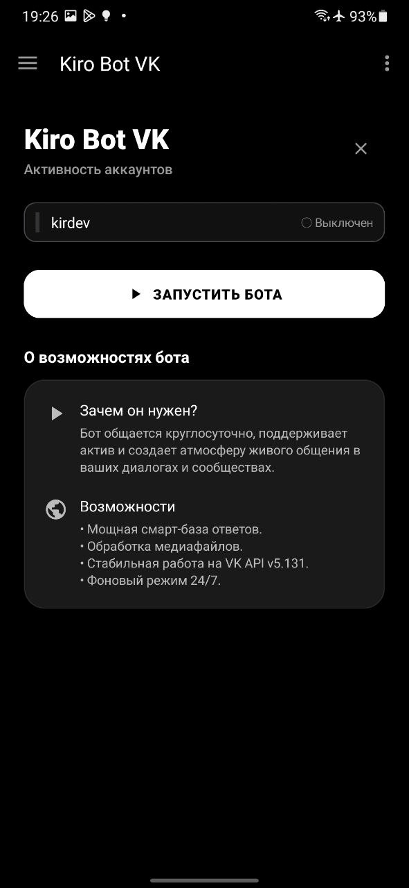

---

## ✨ Основные возможности

### 🧠 Интеллектуальный поиск (BotBrain v2.1.8)
Система использует 6 уровней приоритета для максимально точных ответов:
- **Regex** — мощный поиск по регулярным выражениям.
- **Fuzzy Search** — понимает опечатки (алгоритм Левенштейна).
- **Exact Match** — мгновенные ответы на точные фразы.
- **Контекстный поиск** — учитывает историю диалога.
- **Динамические переменные** — поддержка `{name}`, `{time}`, `{date}`, `{random}` и др.

### 👥 Мультиаккаунтность и Сообщества
Управляйте 5 ботами одновременно из одного приложения. Полная поддержка **сообществ ВКонтакте** и личных профилей. Каждому боту можно назначить свои правила и отслеживать его статистику отдельно.

### 📎 Продвинутая работа с вложениями
Бот умеет реагировать на:
- 🎙️ **Голосовые сообщения**
- 🖼️ **Фотографии**
- 🎥 **Видео**
- 📂 **Документы и файлы**
- 🎨 **Граффити**
Для каждого типа вложения предусмотрены умные и юмористические сценарии ответов.

### 🛡️ Система защиты (Blacklist)
Встроенная система "Защита" позволяет блокировать нежелательных пользователей по ID или ссылке, предотвращая спам и троллинг.

---

## 📱 Интерфейс и Мониторинг

  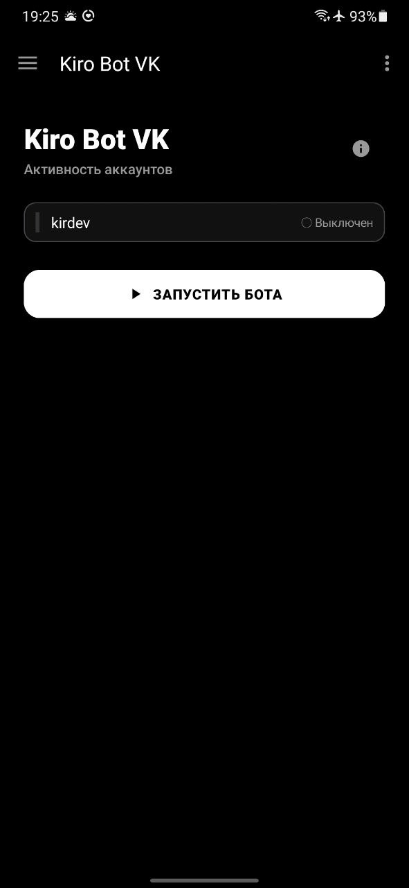
  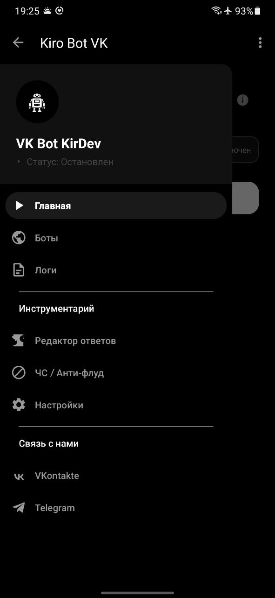
  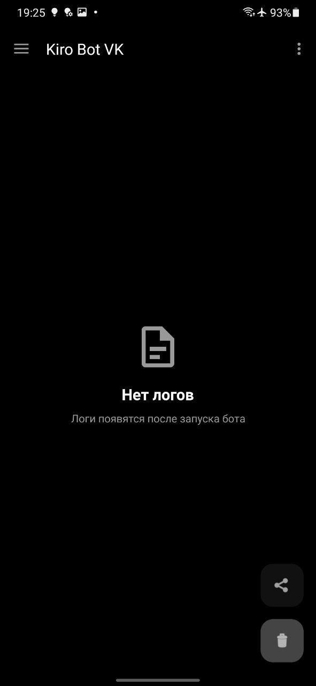

  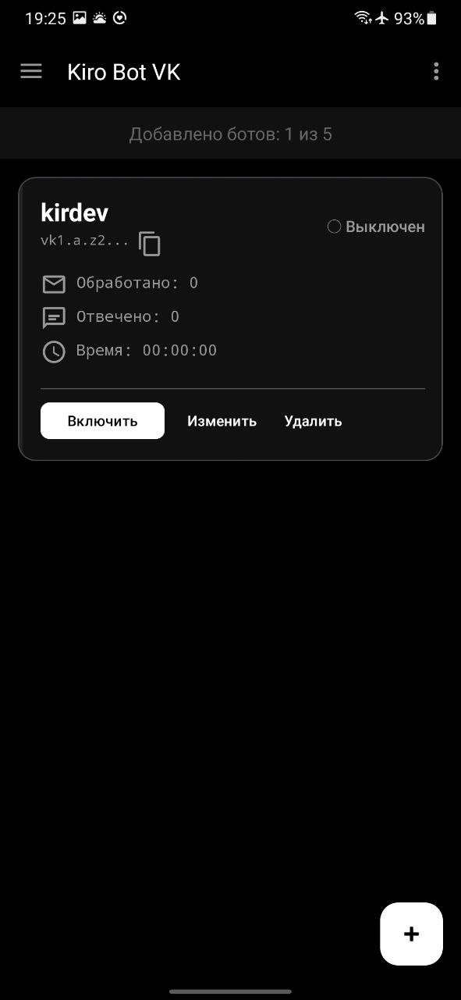
  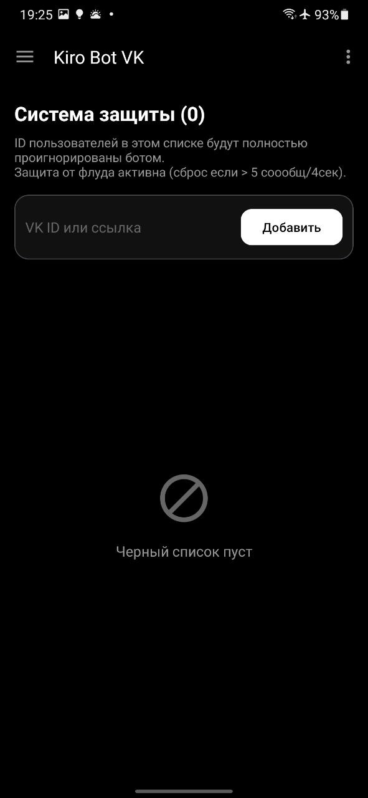
  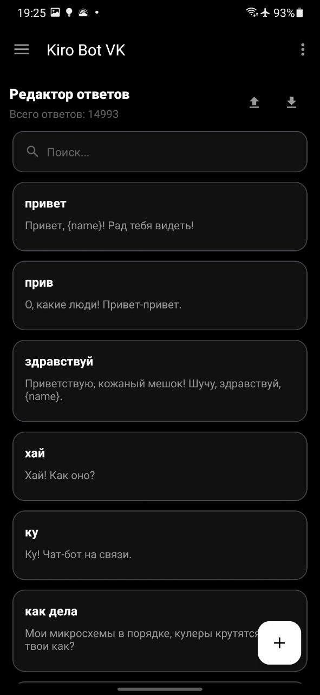

  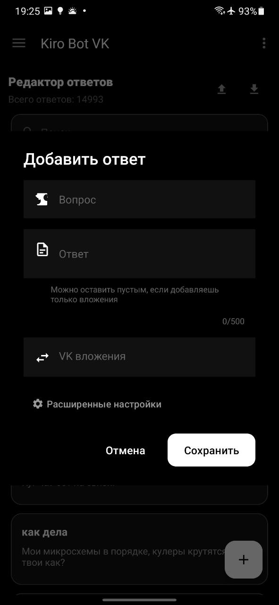
  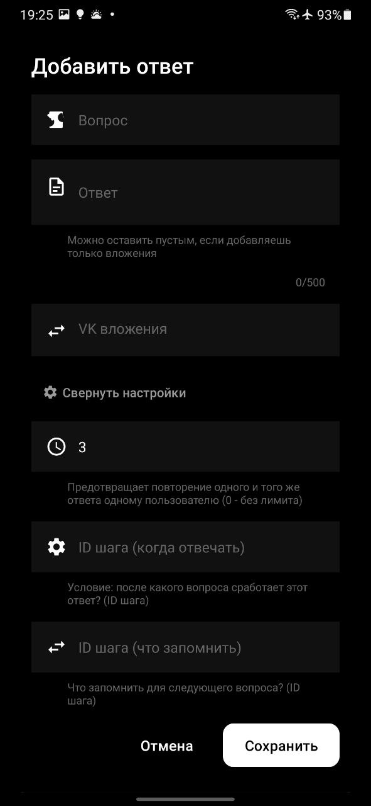
  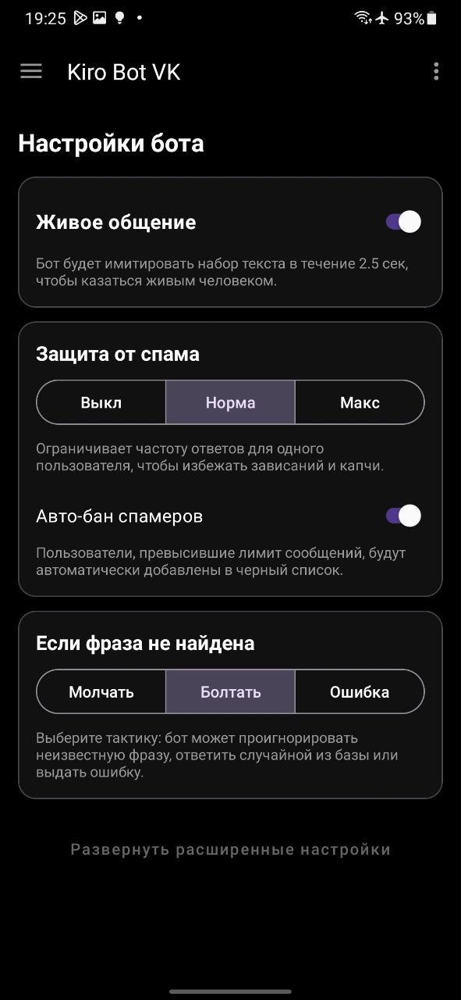

  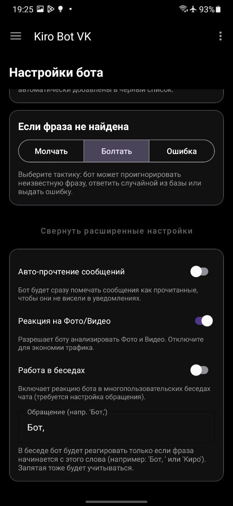

- **Редактор ответов:** Удобное добавление и редактирование правил с поддержкой вложений.
- **Живые логи:** Консоль с цветовой индикацией всех событий в реальном времени.
- **Статистика:** Подробные счетчики обработанных сообщений и времени работы.
- **Material 3:** Современный дизайн с поддержкой темной темы.

---

## 🚀 Быстрый старт

1. **Добавьте бота:** В разделе "Аккаунты" вставьте токен вашего сообщества или профиля.
2. **Настройте базу:** В "Редакторе" создайте свои первые правила.
3. **Запустите:** Нажмите кнопку "Запустить бота" на главном экране.

> [!TIP]
 > Для стабильной работы в фоне разрешите приложению "Автозапуск" и отключите ограничения экономии энергии в настройках Android.

---

## 🛠 Технический стек

- **VK API Version:** 5.131 (Long Poll)
- **Language:** Kotlin & Java
- **Core:** UI via Material Design 3, Coroutines for async tasks.
- **Architecture:** Service-based (Foreground Service + Watchdog).
- **Security:** Local-first storage (SharedPreferences + Files).

---

## 🔒 Политика конфиденциальности и Лицензия

**Политика конфиденциальности (Privacy Policy):**
Приложение работает полностью автономно и локально. Приложение **не собирает, не хранит и не передает** никакие пользовательские данные разработчику или третьим лицам. Все токены, настройки бота, логи и базы данных сохраняются исключительно на вашем устройстве.

**Лицензия и ограничения использования:**
- Данное приложение предназначено **исключительно для личного использования**.
- **Категорически запрещается** модифицировать исходный код или дизайн приложения.
- **Запрещается** присваивать авторство данного приложения себе или выдавать его за свой собственный продукт.
- Любые изменения, декомпиляция или распространение изменённых версий запрещены. 

Подробности в файле [LICENSE.md](LICENSE.md).

---

**Developed with ❤️ by KirDev**
